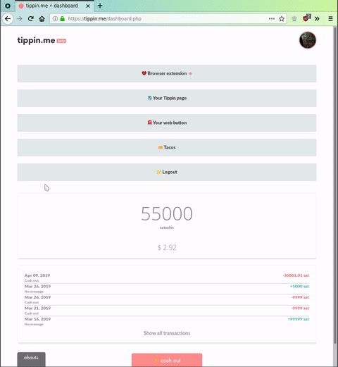

<p align="center">
  
</p>

<p align="center">The companion browser extension for c-lightning, Eclair and Ptarmigan nodes.</p>

<p align="center">
  <a href="https://addons.mozilla.org/firefox/addon/kwh/"></a>
  <a href="https://chrome.google.com/webstore/detail/kwh/mbjlodgfcaknfbphnnfioilcnippdnjp"></a>
</p>

## Features

- Browse balance and latest transactions;
- [`webln`](https://webln.dev/#/) support;
- Pay highlighted invoice with a context menu click;
- Handle `lightning:` links;
- ["Generate invoice here"](https://youtu.be/wzkxxz5FsJo) context menu;
- Manual payments and invoice creation;
- Instant notifications on received payments;
- No window popups, all interactions happen in the `browserAction` popup.

<p align="center">
  
</p>

## Requirements

Either

  * a [lightningd](https://github.com/ElementsProject/lightning/) node with a [Spark](https://github.com/shesek/spark-wallet) [RPC server](https://github.com/fiatjaf/sparko) in front of it;
  * an [Eclair](https://github.com/ACINQ/eclair) node with the [API](https://github.com/ACINQ/eclair#configuring-eclair) enabled and accessible;
  * a [Ptarmigan](https://github.com/nayutaco/ptarmigan) node with the [REST API Node.js app](https://github.com/nayutaco/ptarmigan/blob/master/docs/howtouse_rest_api.md) running.

### Caveats

  * If you are using **Google Chrome**, consider enabling the `Experimental Extension APIs` flag on chrome://flags for a better experience. Read more in [this issue](https://github.com/fiatjaf/kwh/issues/4#issuecomment-485288552).
  * If you are using Eclair, [the WebSocket won't connect on Firefox](https://github.com/ACINQ/eclair/issues/1001), so you won't get notifications when a payment is sent or received, the experience will not be as nice as if it did.

## Build instructions

You'll need: Node.js>=10, npm, Make

```
npm install
make extension.zip
```

---

<div>Icons made by <a href="https://www.flaticon.com/authors/smalllikeart" title="smalllikeart">smalllikeart</a> from <a href="https://www.flaticon.com/" title="Flaticon">Flaticon</a> and licensed by <a href="http://creativecommons.org/licenses/by/3.0/" title="Creative Commons BY 3.0" target="_blank">CC 3.0 BY</a>.</div>
